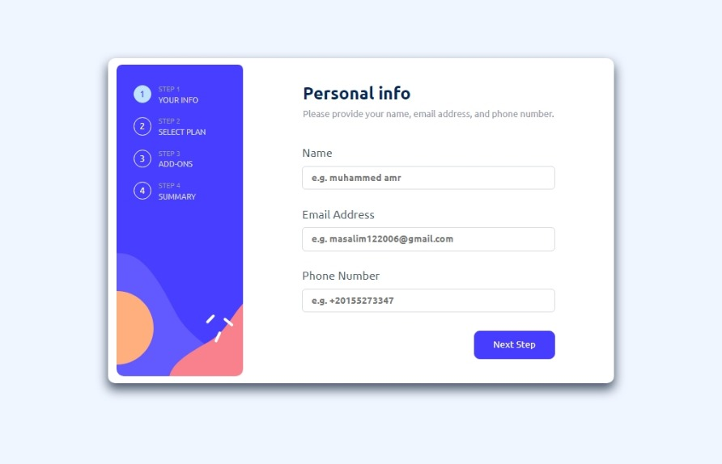

# Frontend Mentor - Multi-step form solution

This is a solution to the [Multi-step form challenge on Frontend Mentor](https://www.frontendmentor.io/challenges/multistep-form-YVAnSdqQBJ). Frontend Mentor challenges help you improve your coding skills by building realistic projects. 

## Table of contents

- [Overview](#overview)
  - [The challenge](#the-challenge)
  - [Screenshot](#screenshot)
  - [Links](#links)
- [My process](#my-process)
  - [Built with](#built-with)
  - [What I learned](#what-i-learned)
  - [Continued development](#continued-development)
  - [Useful resources](#useful-resources)
- [Author](#author)
- [Acknowledgments](#acknowledgments)

**Note: Delete this note and update the table of contents based on what sections you keep.**

## Overview

### The challenge

Users should be able to:

- Complete each step of the sequence
- Go back to a previous step to update their selections
- See a summary of their selections on the final step and confirm their order
- View the optimal layout for the interface depending on their device's screen size
- See hover and focus states for all interactive elements on the page
- Receive form validation messages if:
  - A field has been missed
  - The email address is not formatted correctly
  - A step is submitted, but no selection has been made

### Screenshot

### Links

- Solution URL: [Add solution URL here](https://www.frontendmentor.io/solutions/multi-step-form-solution-mvu5S0qn3X)
- Live Site URL: [Add live site URL here](https://muhamadelsayed.github.io/Multi-step-form/)
- git hub repo : (https://github.com/muhamadelsayed/Multi-step-form)
## My process

### Built with

- Semantic HTML5 markup
- CSS
- Vanillia JavaScribt

### What I learned

- builing responsive website
- better knowledge in css dimintioans
- great train on JS
- making new elements from nothing
- alot more in making the same design patterns

### Continued development

Use this section to outline areas that you want to continue focusing on in future projects. These could be concepts you're still not completely comfortable with or techniques you found useful that you want to refine and perfect.

**Note: Delete this note and the content within this section and replace with your own plans for continued development.**

### Useful resources

- It was that easy so I don't remember any thing

## Author

- Website - [Muhammed Amr Sleem](https://mostaql.com/u/abdelrahman_am/portfolio)
- Frontend Mentor - [@yourusername](https://www.frontendmentor.io/profile/muhamadelsayed)
- Twitter - [@yourusername](https://twitter.com/muhammad200666)
- live view - (https://muhamadelsayed.github.io/Multi-step-form/)

## Acknowledgments

- done alone
